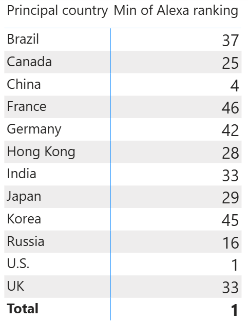

# 🌐 Power BI Top Websites Analysis

A data cleaning and visualization project using Power BI, analyzing the world's top 50 websites and their Alexa rankings by country.

## 📊 Project Overview

This project demonstrates advanced data cleaning techniques in Power BI, including text extraction, trimming, and type conversion, followed by a matrix visualization of the best-ranked websites per country.

## 🗂️ Dataset

| File | Description |
|------|-------------|
| `Top_websites.xlsx` | Top 50 global websites with Alexa rankings, SimilarWeb rankings, type, and principal country (January 2019) |

## 🛠️ Steps Performed

### 1. Data Import
- Imported `Top_websites.xlsx` into a new Power BI Desktop report

### 2. Data Cleaning (Power Query Editor)
- Renamed the dataset to **Websites**
- Promoted first row as headers
- Renamed column: `Alexa top 50 global sites (As of January 17, 2019[update])[3]` → **Alexa ranking**
- Removed the **SimilarWeb** column (not needed for analysis)
- Cleaned the Alexa ranking column using **Extract → Text Before Delimiter** with `(` to remove rank change indicators (e.g. `6 (2)` → `6`)
- Applied **Trim** to remove trailing whitespace
- Converted **Alexa ranking** column to **Whole Number** format

### 3. Visualization
- Built a **Matrix** visual showing the minimum (best) Alexa ranking per country
  - Rows: Principal country
  - Values: Min of Alexa ranking

## 📈 Key Insights

- **U.S.** has the best global ranking with rank **1** (Google)
- **China** follows with rank **4** (Baidu)
- **Russia**'s best ranked site is **VK** at rank **16**

## 🖼️ Preview

### Matrix – Best Alexa Ranking by Country

## 🧰 Tools Used

- Microsoft Power BI Desktop
- Power Query Editor
- Excel (.xlsx)
